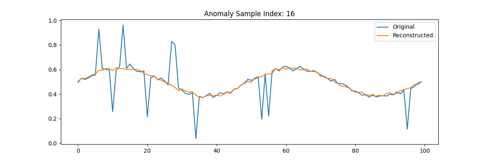

# 🚨 DBN-Based Time-Series Anomaly Detection
<br> 
This project implements an unsupervised anomaly detection system using Deep Belief Networks (DBNs) built from Restricted Boltzmann Machines (RBMs). It is designed to detect abnormal patterns in 1D time-series data, especially when labeled anomalies are unavailable.

<br>
The core idea is simple but powerful:

<br>

- Train a DBN on normal patterns.

- Use *reconstruction error* to identify anomalies — since unusual patterns are poorly reconstructed by a model trained on normal data.
<br>

## Project Definition
<br>

- Synthetic or Real Data: Use pre-generated signals or plug in your own CSV time-series.

- RBM Stack (DBN): Layer-wise training with Contrastive Divergence.

- Unsupervised Learning: No labels or prior anomaly definitions needed.

- Thresholding: Uses 90th percentile of reconstruction error as an anomaly cutoff.

- Visual Diagnostics: Built-in plots for errors and reconstructions.


<br>

## Project Structure
<br>

```markdown-tree
DBN_Anomaly_Detection/
├── main.py       # Entry point: trains DBN and detects anomalies 
├── rbm.py        # RBM class (unsupervised learning unit)
├── dbn.py        # DBN class managing stacked RBMs 
├── data_utils.py # Synthetic generation, CSV loading, and preprocessing
├── anomaly_utils.py # Reconstruction, error computation, anomaly flagging 
├── requirements.txt # Python package dependencies
└── README.md        # Project documentation
```
<br>


## Function Definitions
<br>

### 1. `main.py`
- **main()**
  -  runs the entire DBN training and anomaly detection pipeline.
  - Handles data loading (synthetic or CSV), training, evaluation, and plotting.

### 2. `data_utils.py`
- **generate_normal_series(seq_length=100, num_series=1000)**
  - Generates sinusoidal time-series with Gaussian noise.

- **inject_anomalies(data, anomaly_fraction=0.1)**
  - Adds spikes/drops to synthetic data to simulate anomalies.  

- **create_sequences(series, seq_length=100)**
  - Converts 1D time-series into overlapping 2D windows for modeling.


- **load_time_series(input_type="csv", manual_data=None, filename=None, column_index=1, normalize=True)**
  - Loads time-series from a CSV, manual list, or generates synthetic data.
  - Supports normalization and column selection. 

### 3. `rbm.py`
- **class RBM(nn.Module)**
  - Core unsupervised building block of the DBN.
- **__init__(self, n_visible, n_hidden, k=1)**
  - Initializes weights and biases.
- **sample_from_prob(self, p)**
  - Performs Bernoulli sampling from a probability tensor.
- **v_to_h(self, v)**
  - Computes hidden probabilities and samples from them. 
- **h_to_v(self, h)**
  - Computes visible probabilities and samples from them.
- **contrastive_divergence(self, v, lr=0.01)**
  - Trains RBM using Contrastive Divergence (CD-k).

### 4. `dbn.py`
- **class DBN**
  - Stacks multiple RBMs to form a Deep Belief Network.
- **__init__(self, n_visible, hidden_layers, k=1)**
  - Initializes multiple RBMs with layer-wise sizes.
- **train_dbn(self, data, epochs=10, lr=0.01, batch_size=64)**
  - Trains each RBM layer using unsupervised learning.
- **get_representation(self, x)**
  - Passes input through all RBM layers to get latent features.

### 5. `anomaly_utils.py`
- **reconstruct(rbm, v)**
  - Reconstructs input v using a single trained RBM.
- **compute_reconstruction_errors(data, rbm, batch_size=128)**
  - Computes MSE between original and reconstructed samples.
- **flag_anomalies(recon_errors, threshold)**
  - Flags inputs as anomalies if their reconstruction error exceeds the threshold.
- **apply_model(time_series_data, dbn_model)**
  - visualizing original vs reconstructed time-series using a full DBN.

<br>    

## Project Flow
<br>

1. **Data Preparation**

   * Load or generate a 1D time-series dataset.
   * If synthetic, anomalies are injected to simulate real-world faults.
   * The data is normalized and split into overlapping windows (sequences).

2. **Model Training**

   * A Deep Belief Network (DBN) is trained in an unsupervised manner.
   * The DBN consists of stacked RBMs, each learning to compress and reconstruct the input patterns.

3. **Reconstruction and Error Computation**

   * Each input sequence is passed through the trained model and reconstructed.
   * Reconstruction error is calculated for every sequence (e.g., using mean squared error).

4. **Anomaly Detection**

   * A statistical threshold (e.g., 90th percentile of error) is used to flag sequences with high reconstruction error as anomalies.

5. **Visualization**

   * Plots are generated to show:

     * Sample time-series with anomalies.
     * Distribution of reconstruction errors.
     * Original vs reconstructed sequences for anomalous samples.

<br>     


## 🧑‍💻 User Instructions

#### 1. **Clone the Project**

```bash
git clone https://github.com/Sairaj213/DBN_Anomaly_Detection.git
cd DBN_Anomaly_Detection
```

---

#### 2. **Install Required Packages**

```bash
pip install -r requirements.txt
```


---

#### 3. **Run with Synthetic Data (Default)**

```bash
python main.py
```

* Generates clean sinusoidal signals with random anomalies.
* Trains a Deep Belief Network (DBN).
* Detects and visualizes anomalies.

---

#### 4. **Use Your Own CSV Time-Series**

To use your own data:

1. Open `main.py`
2. Scroll to the section marked:

   ```
   #  SECTION 1: CHOOSE DATA SOURCE
   ```
3. **Comment out** the lines:

```python
normal_data = generate_normal_series(...)
anomalous_data = inject_anomalies(...)
```

4. **Uncomment** the block:

```python
df = pd.read_csv("your_data.csv")
series = df['value'].values
...
```

5. Replace:

   * `"your_data.csv"` with the path to your CSV file.
   * `'value'` with the correct column name from your file.

---

#### 5. **Important Notes**

*  **Close Each Plot Window**
  The program pauses after each plot (`plt.show()`). Close the window to continue.

*  **Anomaly Detection Threshold**
  Uses the 90th percentile of reconstruction errors. Adjustable in `main.py`.

*  **Sequence Length**
  Default is 100. Can be changed in `create_sequences()`.


<br> 
     
## Sample Plot Output :
<br> 

  

  